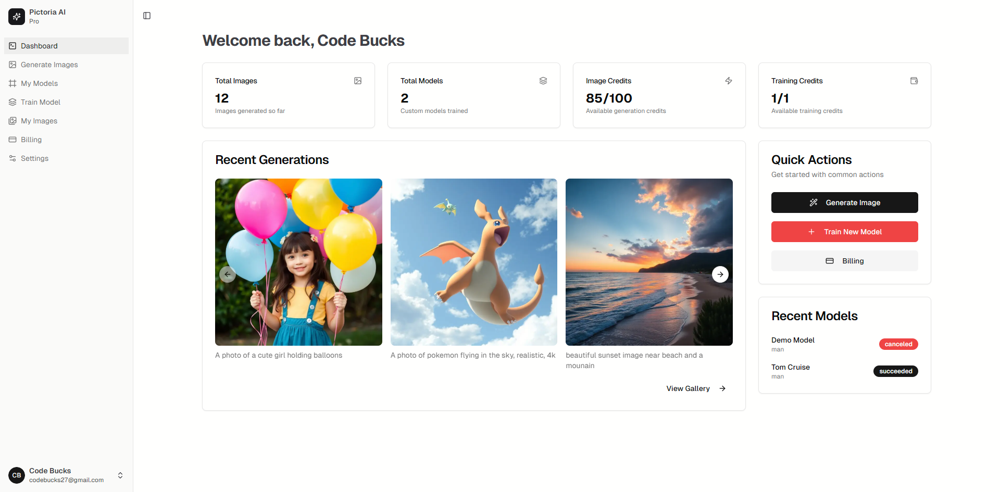
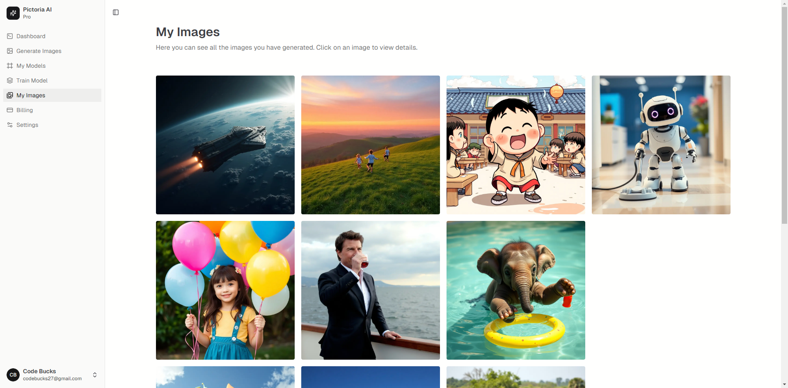

# Pictoria AI Starter Code

An AI-powered image generation and management dashboard built with Next.js, TypeScript, and Supabase. This project provides a modern, full-stack template for building AI-driven SaaS products with user authentication, billing, image gallery, and model training features.

## Features

- User authentication (login, signup, password reset)
- Account management and security settings
- AI image generation and gallery
- Model training and management
- Billing and subscription management (Stripe integration)
- Responsive dashboard UI
- Modern component-based architecture (React, Next.js)
- Supabase backend integration

## Getting Started

### Prerequisites
- Node.js (v18+ recommended)
- npm or yarn
- Supabase project (for authentication and database)
- Stripe account (for billing)

### Installation

```bash
# Clone the repository
git clone <your-repo-url>
cd Pictoria-AI-Starter-Code

# Install dependencies
npm install
# or
yarn install
```

### Environment Variables

Create a `.env.local` file in the root directory and add the following (replace with your actual keys):

```env
NEXT_PUBLIC_SUPABASE_URL=your_supabase_url
NEXT_PUBLIC_SUPABASE_ANON_KEY=your_supabase_anon_key
STRIPE_SECRET_KEY=your_stripe_secret_key
NEXT_PUBLIC_STRIPE_PUBLISHABLE_KEY=your_stripe_publishable_key
```

### Running the App

```bash
npm run dev
# or
yarn dev
```

The app will be available at [http://localhost:3000](http://localhost:3000).

## Folder Structure

```
Pictoria-AI-Starter-Code/
├── public/                # Static assets (images, icons, etc.)
├── screenshots/           # App screenshots
├── src/
│   ├── app/               # Next.js app directory (routes, pages, layouts)
│   ├── components/        # Reusable React components
│   ├── hooks/             # Custom React hooks
│   ├── lib/               # Utility libraries (helpers, API clients)
│   ├── store/             # State management
│   └── middleware.ts      # App-wide middleware
├── database.types.ts      # Database type definitions
├── package.json           # Project metadata and scripts
├── tailwind.config.ts     # Tailwind CSS configuration
└── README.md              # Project documentation
```

## Screenshots




## Usage

- Sign up or log in to your account
- Generate AI images and view them in your gallery
- Train new models and manage existing ones
- Manage your subscription and billing information
- Update your account settings and security preferences

## Contributing

Contributions are welcome! Please open issues or submit pull requests for improvements and bug fixes.

## License

[MIT](LICENSE) (add your license file if needed)

## Credits

- Built with [Next.js](https://nextjs.org/), [React](https://react.dev/), [Supabase](https://supabase.com/), and [Stripe](https://stripe.com/)
- Starter code and UI inspired by modern SaaS best practices 